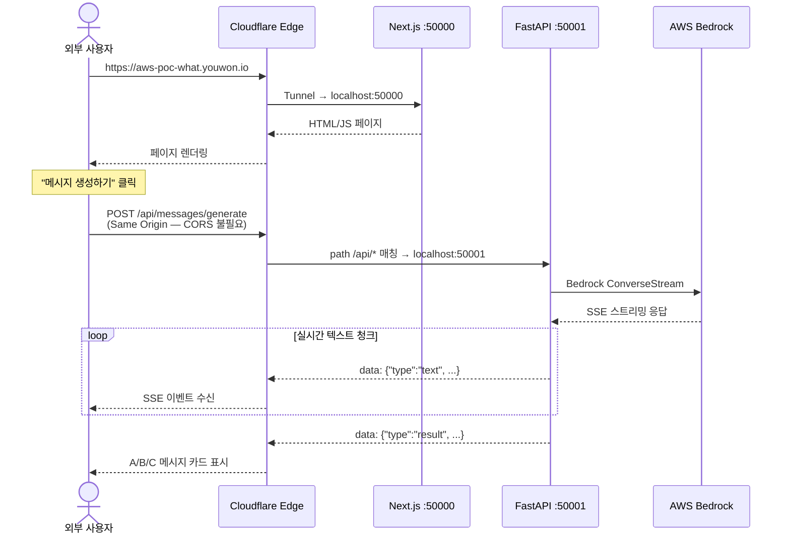
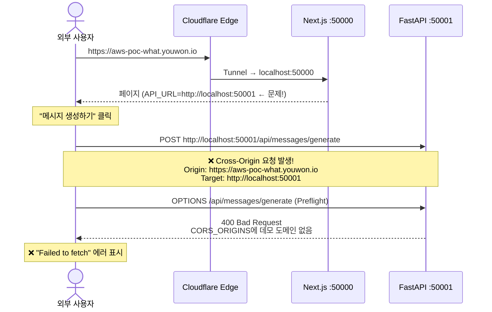

# 데모 배포 가이드

> 로컬 개발 서버를 Cloudflare Tunnel로 외부에 노출하여, 고정 도메인으로 데모를 진행합니다.
>
> **데모 URL**: https://aws-poc-what.youwon.io

---

## 아키텍처

```
                         ┌──────────────────────┐
  외부 사용자 브라우저    │  Cloudflare Edge      │      로컬 PC
  ─────────────────►    │  (HTTPS 자동 적용)     │    ┌─────────────────┐
  aws-poc-what.         │                       │    │                 │
    youwon.io           │  /api/*  ──────────────┼──► │ BE :50001       │
                        │                       │    │ (FastAPI)       │
                        │  /*      ──────────────┼──► │ FE :50000       │
                        │                       │    │ (Next.js)       │
                        └──────────────────────┘    └─────────────────┘
                              Cloudflare Tunnel
                              (암호화된 QUIC 연결)
```

핵심: Cloudflare Tunnel의 **path 기반 라우팅**으로 `/api/*` 요청은 백엔드로, 나머지는 프론트엔드로 분리합니다. nginx 같은 별도 리버스 프록시가 필요 없습니다.

---

## 요청 흐름 (시퀀스)

### 정상 동작 — 메시지 생성



### CORS Preflight 문제 (해결 과정)

처음에는 `.env.demo` 오버라이드가 동작하지 않아 아래 문제가 발생했습니다:



**원인**: `dotenv-cli`에서 `-e .env -e .env.demo` 사용 시, **뒤의 파일이 앞의 값을 덮어쓰지 않음** (먼저 로드된 값 유지)

`dotenv-cli`의 기본 동작은 **first wins** — 먼저 로드된 파일의 값이 우선입니다.
뒤에 로드되는 파일은 아직 존재하지 않는 **새 변수만 추가**할 수 있습니다.

```bash
# ❌ 기본 동작: .env.demo의 값이 무시됨 (.env의 값이 이미 존재하므로)
dotenv -e .env -e .env.demo -- printenv NEXT_PUBLIC_API_URL
# → http://localhost:50001  (원래 .env 값 그대로)
```

**해결**: `-o` (override) 플래그를 추가하면 **last wins** — 나중에 로드된 파일이 기존 값을 덮어씁니다.

```bash
# ✅ -o 플래그: .env.demo가 .env의 값을 덮어씀
dotenv -e .env -o -e .env.demo -- printenv NEXT_PUBLIC_API_URL
# → (빈 값)  (.env.demo의 NEXT_PUBLIC_API_URL= 이 적용됨)
```

```diff
- dotenv -e .env -e .env.demo -- pnpm -C fe run dev
+ dotenv -e .env -o -e .env.demo -- pnpm -C fe run dev
```

이렇게 하면 `.env`의 기본 설정(AWS 자격증명, 리전 등)은 그대로 상속하면서, `.env.demo`에 정의된 값만 덮어씁니다:
- `NEXT_PUBLIC_API_URL=` (빈 값으로 덮어씀) → 브라우저가 **같은 도메인으로 API 호출** → CORS 불필요
- `CORS_ORIGINS`에 데모 도메인 추가 (덮어씀) → 혹시 모를 cross-origin 요청도 허용
- `AWS_PROFILE`, `AWS_REGION`, `DEFAULT_MODEL_ID` → `.env`에서 그대로 상속 (`.env.demo`에 없으므로)

---

## 사전 준비 (1회성)

### 1. Cloudflare 인증

```bash
# cloudflared가 설치되어 있어야 함
brew install cloudflared

# Cloudflare 계정 로그인 → 브라우저에서 도메인(youwon.io) 선택
cloudflared tunnel login
```

### 2. 터널 생성 + DNS 연결

```bash
# 고정 터널 생성 (PC 재부팅해도 동일 터널 ID 유지)
cloudflared tunnel create aws-poc-what

# DNS 레코드 자동 등록 (CNAME → 터널)
cloudflared tunnel route dns aws-poc-what aws-poc-what.youwon.io
```

### 3. Tunnel 설정 파일

`~/.cloudflared/config.yml`:

```yaml
tunnel: bd514ee1-3ca1-4697-a88a-0b8a9812b3e2
credentials-file: /Users/tehokang/.cloudflared/bd514ee1-3ca1-4697-a88a-0b8a9812b3e2.json

ingress:
  # /api/* 요청은 FastAPI 백엔드로 직행
  - hostname: aws-poc-what.youwon.io
    path: /api/.*
    service: http://localhost:50001
    originRequest:
      noTLSVerify: true

  # 나머지는 Next.js 프론트엔드로
  - hostname: aws-poc-what.youwon.io
    service: http://localhost:50000
    originRequest:
      noTLSVerify: true

  # Catch-all (Cloudflare 필수 규칙)
  - service: http_status:404
```

---

## 데모 실행

### 시작

```bash
# worktree 디렉토리에서
cd .worktrees/BMV2-10678-링크분석-개선

# FE + BE + Tunnel 동시 실행
pnpm demo
```

이 명령은 내부적으로 세 개의 프로세스를 동시에 실행합니다:

| 프로세스 | 명령 | 설명 |
|----------|------|------|
| `FE` | `dotenv -e .env -o -e .env.demo -- pnpm -C fe run dev` | Next.js (NEXT_PUBLIC_API_URL=빈값) |
| `BE` | `dotenv -e .env -o -e .env.demo -- uvicorn ...` | FastAPI (CORS에 데모 도메인 포함) |
| `TUNNEL` | `cloudflared tunnel run aws-poc-what` | Cloudflare Tunnel 연결 |

### 접속

**https://aws-poc-what.youwon.io**

### 종료

```bash
Ctrl+C   # 모든 프로세스 동시 종료
```

### 평소 개발로 복귀

```bash
pnpm dev   # .env만 로드, .env.demo 무시. 기존과 완전히 동일
```

---

## 프로젝트 변경 사항

| 파일 | 유형 | 용도 | 데모 끝나면 |
|------|------|------|------------|
| `.env.demo` | 신규 | 데모용 환경변수 오버라이드 | 유지 (무해) |
| `package.json` | 수정 | `demo`, `demo:fe`, `demo:be`, `demo:tunnel` 스크립트 추가 | 유지 (무해) |
| `~/.cloudflared/config.yml` | 신규 (프로젝트 외부) | Tunnel 라우팅 설정 | 로컬 설정, 프로젝트 무관 |

**소스 코드 변경: 없음** — `next.config.ts`, `api.ts` 등 프로젝트 코드는 일절 수정하지 않았습니다.

---

## 트러블슈팅

### "Failed to fetch" 에러

1. **터널이 실행 중인지 확인**: `pnpm demo` 로그에서 `[TUNNEL] Registered tunnel connection` 메시지 확인
2. **BE가 실행 중인지 확인**: `curl http://localhost:50001/api/health`
3. **CORS 문제**: 브라우저 개발자 도구 Network 탭에서 `OPTIONS` 요청이 400인지 확인. 400이면 `.env.demo`의 `CORS_ORIGINS`에 데모 도메인이 있는지, `pnpm demo`로 실행했는지 확인

### 터널 재연결

PC를 껐다 켜도 터널 설정은 유지됩니다. `pnpm demo`만 다시 실행하면 동일한 `aws-poc-what.youwon.io` 도메인으로 접속 가능합니다.

### 터널 삭제 (더 이상 필요 없을 때)

```bash
cloudflared tunnel delete aws-poc-what
# Cloudflare DNS에서 aws-poc-what.youwon.io CNAME 레코드도 수동 삭제
```
