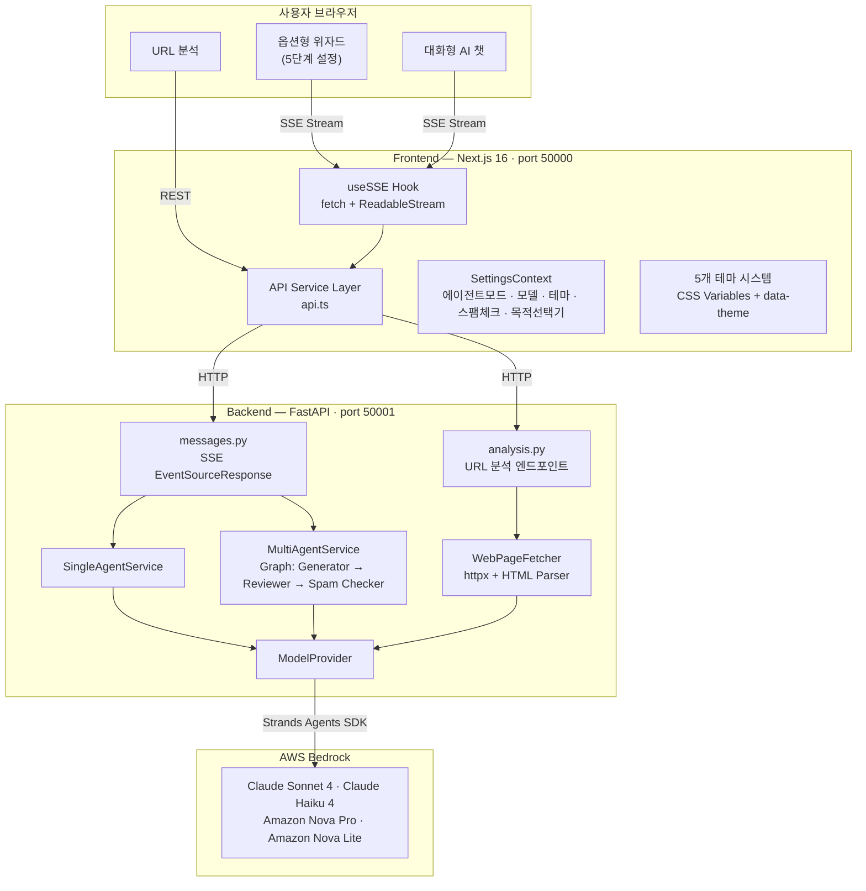
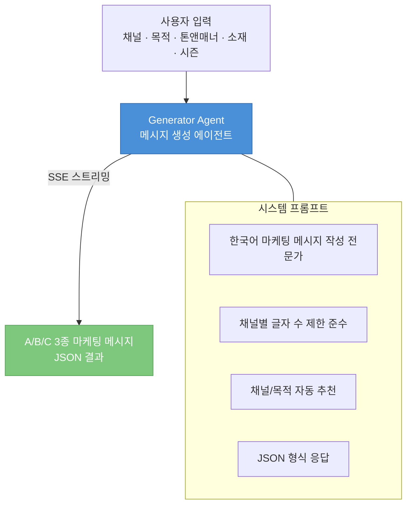
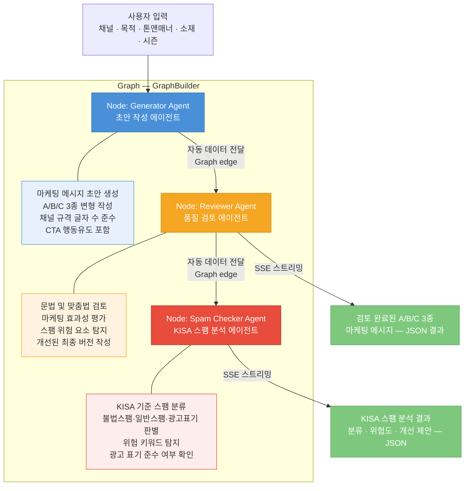
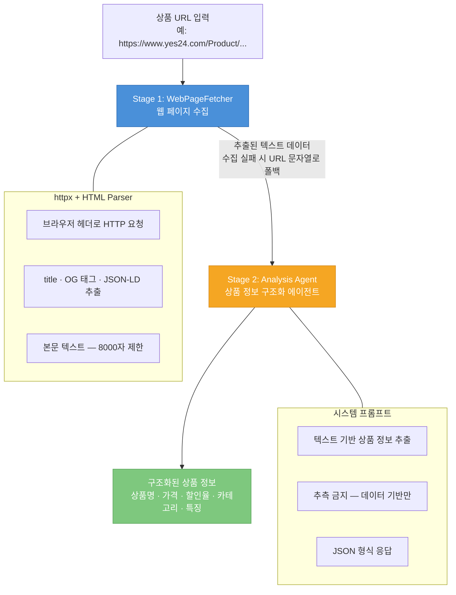
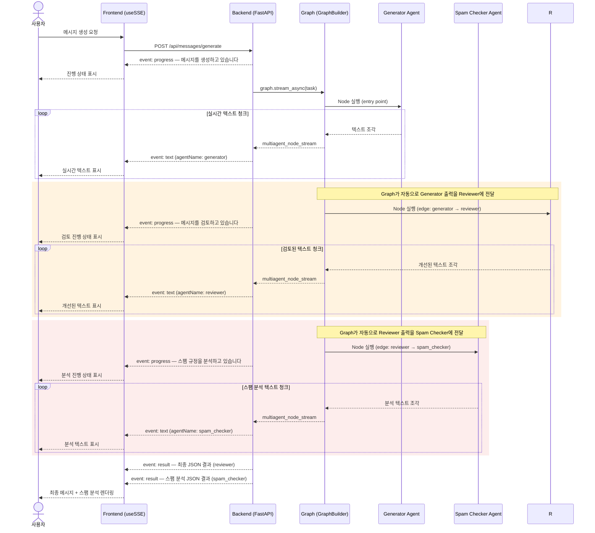

# 센드온 AI 스튜디오 POC

AWS Bedrock LLM 기반 AI 메시지 발송 POC. **WHAT(뭐를) → WHO(누구에게) → WHEN(언제)** 3단계 흐름으로 메시지 작성부터 발송까지 지원합니다.

## 진행 상황

| 단계 | 설명 | 상태 |
|------|------|------|
| **WHAT** | 메시지 작성 — AI가 A/B/C 3종 메시지 생성, 채널/목적 자동 추천, KISA 스팸 분석 | ✅ 완료 |
| **WHO** | 발송 대상 설정 — 개인화 변수 추천, 수신자 피로도 경고, 타겟 그룹 선택 | 🚧 TODO |
| **WHEN** | 발송 시간 설정 — 최적 발송 시간 AI 추천, 예약 발송 | 🚧 TODO |

## 주요 기능

### ✅ WHAT — 메시지 작성하기

#### 메시지 생성

- **옵션형 (단계별)**: 채널 → 목적 → 톤앤매너 → 소재 → 시즌 5단계 설정 후 A/B/C 3종 메시지 자동 생성
- **대화형 (AI 챗)**: 자연어 대화로 메시지 작성 (SSE 실시간 스트리밍)
- **MMS 이미지 업로더**: MMS 채널 선택 시 최대 3장 이미지 첨부, 미리보기 카드 및 요약 패널에 표시
- **소재 필수 입력 검증**: 소재 미입력 시 생성 버튼 비활성화
- **자동 스크롤**: 생성 버튼 클릭 시 결과 영역으로 자동 스크롤

#### AI 자동 추천

- **채널 자동 추천**: 채널 미선택 시 AI가 소재 기반으로 최적 발송 채널(SMS/LMS/MMS/알림톡/친구톡) 추천 + 추천 사유 표시
- **목적 자동 판단**: 목적 선택기 OFF 시 AI가 소재 기반으로 발송 목적 자동 분류
- **URL 링크 보존**: 원본 소재의 URL 링크를 결과 메시지에 유지

#### 에이전트 & 스팸 분석

- **싱글/멀티 에이전트**: 단일 에이전트 vs 생성기→리뷰어→스팸체커 Graph 워크플로우 비교
- **KISA 스팸 분석**: 에이전트 모드와 **독립적으로** ON/OFF 가능. KISA 기준 스팸 분류·광고표기 준수·위험 키워드 분석
- **스팸 판정 시 다음 단계 차단**: 스팸으로 판정된 메시지는 WHO 단계로 진행 불가 (버튼 비활성화 + 경고)
- **모드별 로딩 애니메이션**: 싱글/멀티 에이전트 모드에 맞는 진행 단계 표시

### 🚧 WHO — 누구에게 보낼지 (미구현)

- 개인화 변수 추천 (`PersonalizationVars` 컴포넌트 재사용 예정)
- 수신자 피로도 경고 (`FatigueAlert` 컴포넌트 재사용 예정)
- 타겟 그룹 선택 및 AI 대상 추천

### 🚧 WHEN — 언제 보낼지 (미구현)

- 최적 발송 시간 AI 추천
- 예약 발송 / 즉시 발송 선택
- 정기 발송 스케줄 최적화

### 플랫폼

- **LLM 모델 전환**: Claude Sonnet 4, Claude Haiku, Amazon Nova Pro/Lite 선택
- **5개 디자인 테마**: Sendon(기본), Toss Bank, Retro 8-bit, Dark, Pastel
## 아키텍처

### 전체 시스템 구성



### 에이전트 동작 모드

사용자는 설정 패널에서 **싱글/멀티 에이전트 모드**를 전환할 수 있습니다.
두 모드 모두 옵션형(위자드)과 대화형(챗) 방식에서 동일하게 적용됩니다.

#### 싱글 에이전트 모드 (Single Agent)

하나의 에이전트가 메시지 생성을 직접 수행합니다.



#### 멀티 에이전트 모드 (Multi Agent — Graph Pattern)

세 에이전트가 Strands SDK의 `GraphBuilder`를 사용한 Graph 패턴으로 협력하여 품질을 높입니다.
Generator → Reviewer → Spam Checker 방향 그래프로, 각 노드의 출력이 자동으로 다음 노드에 전달됩니다.



#### URL 분석 파이프라인

상품 URL을 입력하면 웹 페이지에서 상품 정보를 자동 추출합니다.



### SSE 스트리밍 프로토콜

모든 AI 응답은 **Server-Sent Events (SSE)**로 실시간 스트리밍됩니다.



| 이벤트 타입 | 설명 | agentName |
|------------|------|-----------|
| `progress` | 진행 상태 알림 | `generator` / `reviewer` / `spam_checker` |
| `text` | 실시간 텍스트 청크 | `generator` / `reviewer` / `spam_checker` / `assistant` |
| `result` | 최종 구조화된 JSON 결과 | `reviewer` / `spam_checker` |
| `error` | 에러 발생 알림 | `generator` / `reviewer` / `spam_checker` / `assistant` |

## 기술 스택

| 구분 | 기술 |
|------|------|
| Frontend | Next.js 16 (App Router) + TypeScript |
| Backend | Python + FastAPI + AWS Strands Agents SDK |
| 스트리밍 | SSE (fetch + ReadableStream) |
| 테마 시스템 | CSS Variables + `data-theme` 속성 |
| Lambda 배포 | Mangum (Lambda adapter) |
| 패키지 매니저 | pnpm |

## 프로젝트 구조

```
.
├── fe/                          # Frontend (Next.js)
│   ├── src/
│   │   ├── app/                 # App Router 페이지
│   │   │   └── ai-studio/       # AI 스튜디오 라우트
│   │   ├── components/          # React 컴포넌트
│   │   │   ├── ai-message/      # AI 메시지 (option, chat)
│   │   │   ├── layout/          # Sidebar, AppShell, FloatingSettings
│   │   │   ├── ui/              # 공통 UI (Chip, Card, Toggle, Badge)
│   │   │   └── common/          # PlaceholderPage 등
│   │   ├── context/             # SettingsContext (에이전트/모델/테마)
│   │   ├── hooks/               # useSSE, useSettings
│   │   ├── services/            # API 서비스 레이어
│   │   ├── styles/themes/       # 5개 테마 CSS 파일
│   │   └── types/               # TypeScript 인터페이스
│   └── package.json
├── be/                          # Backend (FastAPI)
│   ├── app/
│   │   ├── routes/              # health, models, messages, analysis, mock_data
│   │   ├── services/            # agent_service, multi_agent_service, mock_data_service
│   │   ├── prompts/             # LLM 프롬프트 (generator, reviewer, spam_checker)
│   │   ├── models/              # Pydantic 모델 (requests, responses)
│   │   ├── config.py            # 앱 설정 (CORS, AWS, 모델)
│   │   └── main.py              # FastAPI 앱 진입점
│   ├── lambda_handler.py        # AWS Lambda 핸들러 (Mangum)
│   └── requirements.txt
├── docs/                        # 요구사항, 아키텍처 문서
├── package.json                 # 루트 (FE+BE 동시 기동 스크립트)
├── TODO.md                      # 향후 WHO/WHEN 페이지 이동 예정 기능 기록
├── .env                         # 환경변수 (FE+BE 통합, gitignored)
└── .env.example                 # 환경변수 템플릿
```

## 시작하기

### 사전 요구사항

- **Node.js** 20+
- **pnpm** 10+
- **Python** 3.11+

### 1. 설치

```bash
# FE + BE 전체 설치 (루트 의존성 + FE 의존성 + BE 가상환경/의존성)
pnpm run install:all
```

또는 개별 설치:

```bash
pnpm install           # 루트 의존성 (concurrently, dotenv-cli)
pnpm run install:fe    # FE 의존성 (Next.js 등)
pnpm run install:be    # BE 가상환경 생성 + 의존성 설치 (FastAPI, Strands SDK 등)
```

### 2. 환경변수 설정

모든 환경변수는 프로젝트 루트의 `.env` 하나로 관리합니다.

```bash
cp .env.example .env
# .env 파일을 열고 아래 필드를 환경에 맞게 수정
```

| 변수 | 설명 | 예시 |
|------|------|------|
| `NEXT_PUBLIC_API_URL` | 프론트엔드가 호출할 백엔드 API 주소 | `http://localhost:50001` |
| `AWS_PROFILE` | `~/.aws/credentials`의 프로파일명 (추천) | `aws-aligo-dev` |
| `AWS_REGION` | Bedrock 서비스 리전 | `us-east-1` |
| `DEFAULT_MODEL_ID` | 기본 LLM 모델 ID | `us.anthropic.claude-sonnet-4-20250514-v1:0` |
| `CORS_ORIGINS` | 백엔드 CORS 허용 오리진 (JSON 배열) | `["http://localhost:50000"]` |

**AWS 자격증명 설정 방법:**

- **방법 1 (추천)**: `AWS_PROFILE`에 `~/.aws/credentials`에 등록된 프로파일명을 입력
- **방법 2**: `AWS_PROFILE`을 비우고 `AWS_ACCESS_KEY_ID`, `AWS_SECRET_ACCESS_KEY`를 직접 입력

> AWS 크레덴셜 없이도 서버 기동은 됩니다. LLM 호출 시 에러 이벤트가 SSE로 전달되고, mock 데이터 엔드포인트는 정상 동작합니다.

### 3. 개발 서버 실행

```bash
# FE(50000) + BE(50001) 동시 기동 (hot-reload 자동 적용)
pnpm run dev
```

또는 개별 실행:

```bash
# Frontend만 (Next.js Fast Refresh — 코드 변경 시 즉시 반영)
pnpm run dev:fe

# Backend만 (uvicorn --reload — 코드 변경 시 자동 재시작)
pnpm run dev:be
```

### 4. 접속

- **Frontend**: http://localhost:50000
- **Backend API**: http://localhost:50001
- **API Health**: http://localhost:50001/api/health

## 주요 API 엔드포인트

| Method | Endpoint | 설명 |
|--------|----------|------|
| GET | `/api/health` | 서버 상태 + 사용 가능 모델 목록 |
| GET | `/api/models` | LLM 모델 카탈로그 |
| POST | `/api/messages/generate` | 옵션형 메시지 생성 (SSE 스트리밍) |
| POST | `/api/messages/chat` | 대화형 채팅 (SSE 스트리밍) |
| POST | `/api/analyze-url` | URL 분석 (LLM 기반) |
| GET | `/api/mock/past-messages` | 과거 발송 이력 (mock) |
| POST | `/api/mock/spam-score` | 스팸 점수 분석 (mock 폴백용 — 실제 AI 스팸 분석은 SSE 스트림으로 전달) |
| POST | `/api/mock/fatigue-analysis` | 수신자 피로도 분석 (mock) |

## 개발용 설정 패널

우측 하단 ⚙️ 버튼으로 열리는 플로팅 패널에서:

- **에이전트 모드**: Single(직접 호출) / Multi(생성기→리뷰어→스팸체커) 전환
- **LLM 모델**: Bedrock 모델 선택 (Claude Sonnet, Haiku, Nova 등)
- **테마**: 5개 디자인 테마 실시간 전환
- **스팸 체크**: KISA 스팸 분석 ON/OFF (에이전트 모드와 독립)
- **목적 선택기**: 목적 직접 선택 / AI 자동 판단 전환

## Hot Reload

FE, BE 모두 코드 변경 시 자동 반영됩니다:

- **FE**: Next.js [Fast Refresh](https://nextjs.org/docs/architecture/fast-refresh) — 컴포넌트 수정 시 상태 유지하며 즉시 반영
- **BE**: uvicorn `--reload` 모드 — Python 파일 변경 시 서버 자동 재시작
