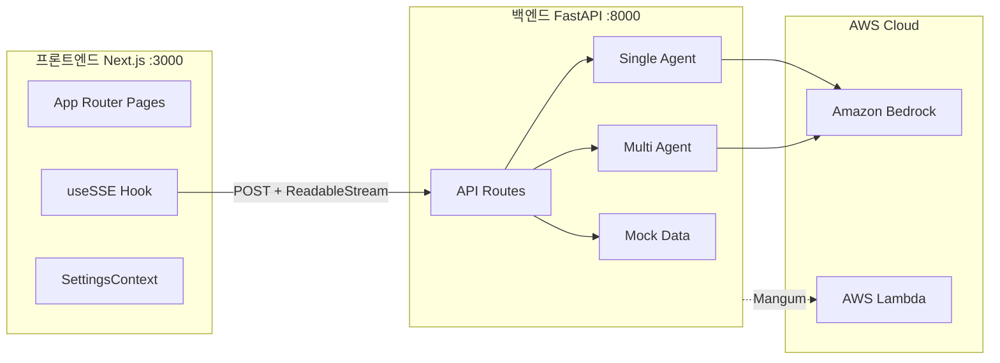

# ADR-02: 시스템 아키텍처

## 상태

승인됨

## 컨텍스트

프론트엔드(Next.js)와 백엔드(FastAPI)를 분리하고,
AI 서비스(Amazon Bedrock)와의 통합 방식을 정의해야 합니다.

## 결정

### 아키텍처 개요

프론트엔드와 백엔드를 독립적인 서비스로 분리하고,
SSE(Server-Sent Events)를 통해 실시간 스트리밍을 구현합니다.

### 프론트엔드 레이어

| 구성요소 | 역할 |
|---------|------|
| App Router Pages | 페이지 라우팅, 레이아웃 관리 |
| useSSE Hook | SSE 스트리밍 통신 (fetch + ReadableStream) |
| SettingsContext | 테마, 에이전트 모드, LLM 모델 등 전역 설정 |

### 백엔드 레이어

| 구성요소 | 역할 |
|---------|------|
| API Routes | HTTP 엔드포인트, SSE 응답 생성 |
| Single Agent | 단일 에이전트 파이프라인 |
| Multi Agent | 순차적 이중 에이전트 파이프라인 |
| Mock Data | LLM 없이 개발/테스트용 목 응답 |

### 통신 흐름

1. 프론트엔드에서 `POST` 요청으로 설정 및 메시지를 전달
2. 백엔드가 에이전트 모드에 따라 적절한 서비스 호출
3. Amazon Bedrock에서 스트리밍 응답 수신
4. SSE 이벤트로 프론트엔드에 실시간 전달

### 배포 전략

- **로컬 개발**: Next.js(:3000) + Uvicorn(:8000) 직접 실행
- **프로덕션**: FastAPI를 Mangum으로 감싸 AWS Lambda에 배포

## 결과

- 프론트엔드/백엔드 독립 개발 및 배포 가능
- Mock 모드로 LLM 없이도 프론트엔드 개발 가능
- 에이전트 모드 전환이 백엔드 라우팅 레벨에서 처리됨
