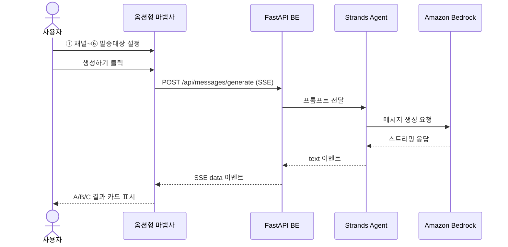

# AI 메시지 — 옵션형

## 개요

6단계 마법사(Wizard) UI를 통해 사용자가 메시지 생성 옵션을 단계별로 설정하고,
설정 완료 시 LLM이 A/B/C 3종의 메시지 후보를 생성합니다.

## 6단계 마법사 흐름

| 단계 | 항목 | 설명 |
|------|------|------|
| ① | 채널 | 발송 채널 선택 (SMS, 카카오톡, 푸시 등) |
| ② | 목적 | 메시지 목적 (프로모션, 안내, 리마인드 등) |
| ③ | 톤앤매너 | 어조 선택 (격식체, 친근체, 유머 등) |
| ④ | 소재입력 | 핵심 내용·키워드 직접 입력 |
| ⑤ | 시즌 | 시즌/이벤트 컨텍스트 (설날, 블프 등) |
| ⑥ | 발송대상 | 타겟 고객 세그먼트 선택 |

각 단계는 독립적인 UI 스텝으로 구성되며, 이전/다음 네비게이션을 제공합니다.
마지막 단계 완료 후 "생성하기" 버튼으로 LLM 호출을 트리거합니다.

## 생성 결과

- A/B/C 3종의 메시지 후보가 카드 형태로 표시됩니다
- 각 카드에는 메시지 본문, 제목, 특징 요약이 포함됩니다
- 사용자는 카드를 선택하거나 재생성을 요청할 수 있습니다

## 시퀀스 다이어그램

## SSE 통신 방식

- 프론트엔드는 `fetch` + `ReadableStream`을 사용하여 SSE를 수신합니다
- `EventSource`는 GET 요청만 지원하므로 POST body 전달이 불가하여 사용하지 않습니다
- 스트리밍 응답은 실시간으로 UI에 반영되어 사용자 체감 응답 시간을 단축합니다
