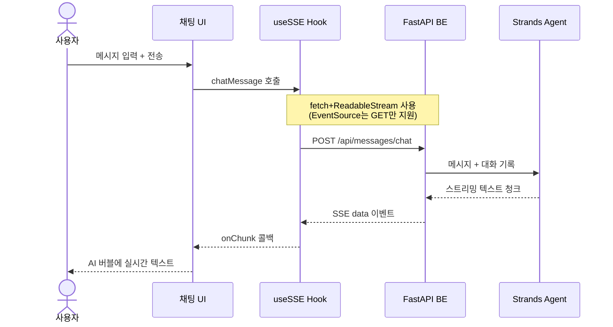

# AI 메시지 — 대화형

## 개요

LLM과의 실시간 채팅 인터페이스를 통해 대화하면서 메시지를 작성합니다.
사용자가 자연어로 요구사항을 전달하면 AI가 메시지를 생성하고,
피드백을 반영하여 반복적으로 개선할 수 있습니다.

## 주요 특징

- **실시간 스트리밍**: AI 응답이 타이핑되듯 실시간으로 표시됩니다
- **대화 기록 유지**: 이전 대화 컨텍스트를 유지하여 연속적인 개선이 가능합니다
- **자유로운 요청**: 옵션형과 달리 정해진 단계 없이 자유롭게 요청할 수 있습니다

## 채팅 UI 구성

- 사용자 메시지 버블 (오른쪽 정렬)
- AI 응답 버블 (왼쪽 정렬, 스트리밍 중 타이핑 인디케이터)
- 하단 입력 영역 (텍스트 입력 + 전송 버튼)

## 시퀀스 다이어그램

## SSE 통신 상세

- `useSSE` 커스텀 훅이 `fetch` API와 `ReadableStream`을 사용합니다
- POST 요청으로 메시지 본문과 대화 기록을 함께 전달합니다
- `EventSource`는 GET 전용이므로 사용하지 않습니다
- 청크 단위로 수신하며 `onChunk` 콜백으로 UI를 업데이트합니다
