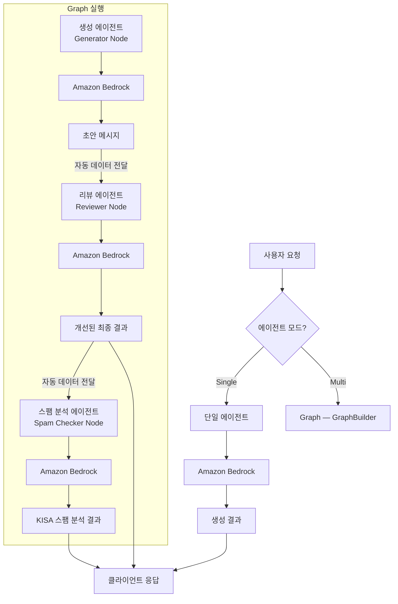

# 에이전트 모드

## 개요

시스템은 두 가지 에이전트 모드를 지원하며,
사용자가 설정 패널에서 실시간으로 전환할 수 있습니다.

## 모드 비교

| 항목 | 싱글 에이전트 | 멀티 에이전트 |
|------|--------------|--------------|
| 에이전트 수 | 1개 | 3개 (Graph) |
| 파이프라인 | 요청 → 생성 → 응답 | 요청 → Graph(생성 → 리뷰 → 스팸분석) → 응답 |
| 응답 속도 | 빠름 | 상대적으로 느림 |
| 품질 | 기본 | 리뷰를 거쳐 개선됨 |
| 용도 | 빠른 초안, 반복 실험 | 최종 품질 메시지 생성 |

## 싱글 에이전트 모드

하나의 Strands Agent가 사용자 요청을 받아 Amazon Bedrock LLM을 호출하고
결과를 직접 반환합니다. 간단하고 빠릅니다.

## 멀티 에이전트 모드

세 개의 에이전트가 Strands SDK의 `GraphBuilder`를 사용한 Graph 패턴으로 동작합니다:

1. **생성 에이전트 (Generator)**: 사용자 요청을 받아 초안 메시지를 생성합니다
2. **리뷰 에이전트 (Reviewer)**: 초안을 검토하고 품질을 개선하여 최종 결과를 반환합니다
3. **스팸 분석 에이전트 (Spam Checker)**: KISA 기준으로 메시지의 스팸 위험도를 분석합니다

> Strands SDK의 `GraphBuilder`를 사용한 Graph 패턴입니다. Generator → Reviewer → Spam Checker 방향 그래프로 데이터가 자동 전달됩니다.

## 흐름 다이어그램

## 모드 전환

- 플로팅 설정 패널에서 토글 스위치로 전환합니다
- 전환 시 기존 대화 기록은 유지됩니다
- 다음 요청부터 선택된 모드가 적용됩니다
